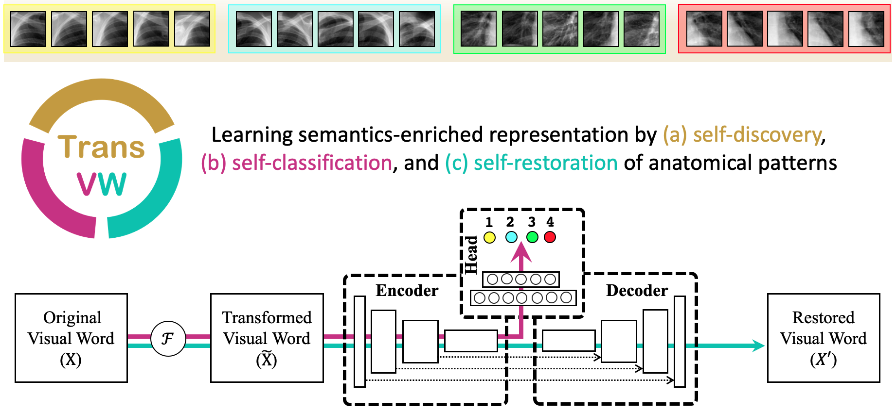
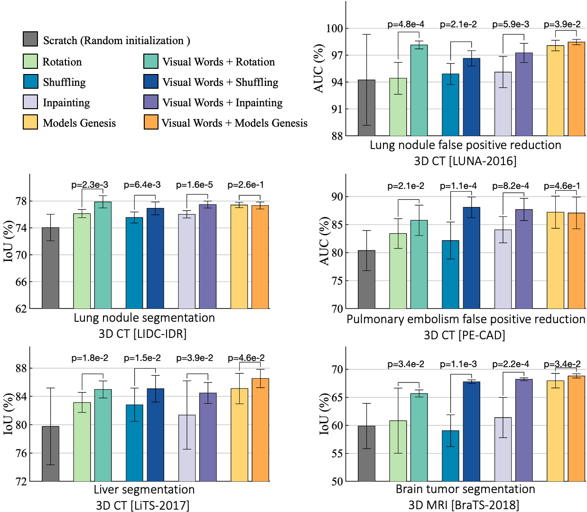
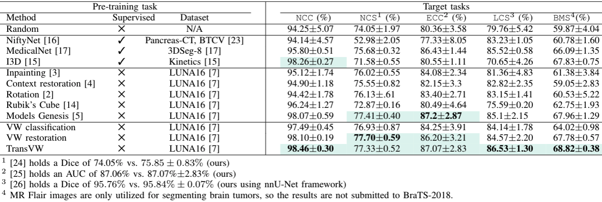
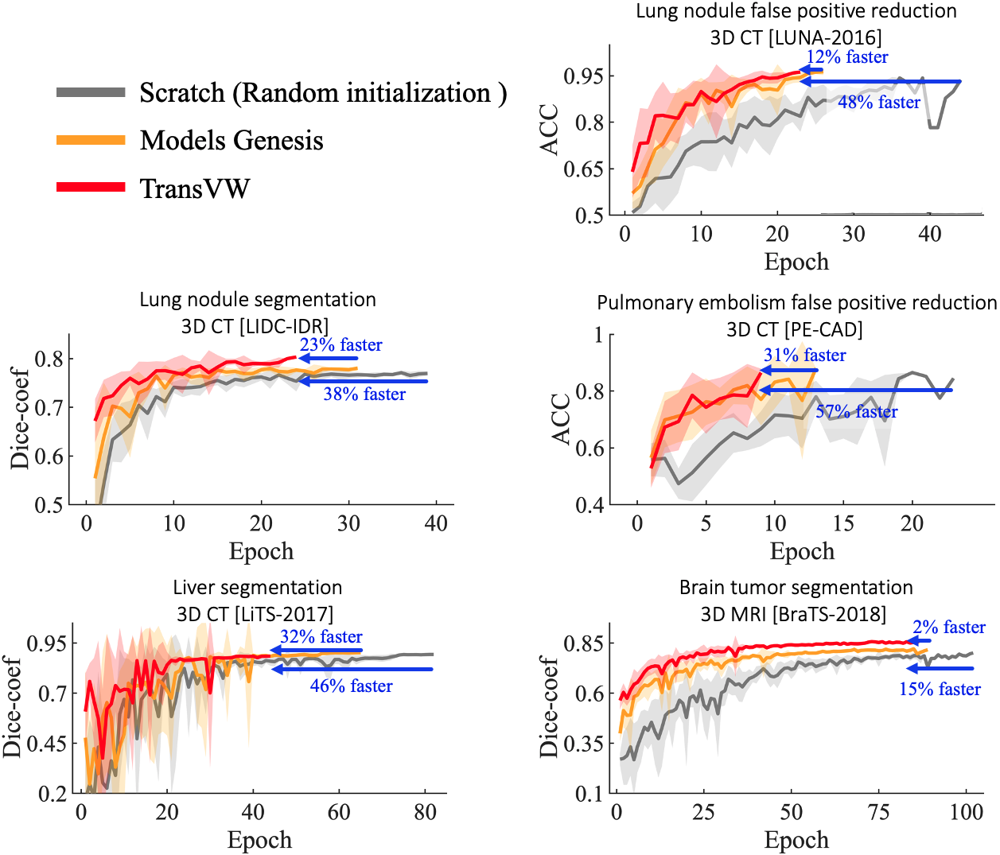
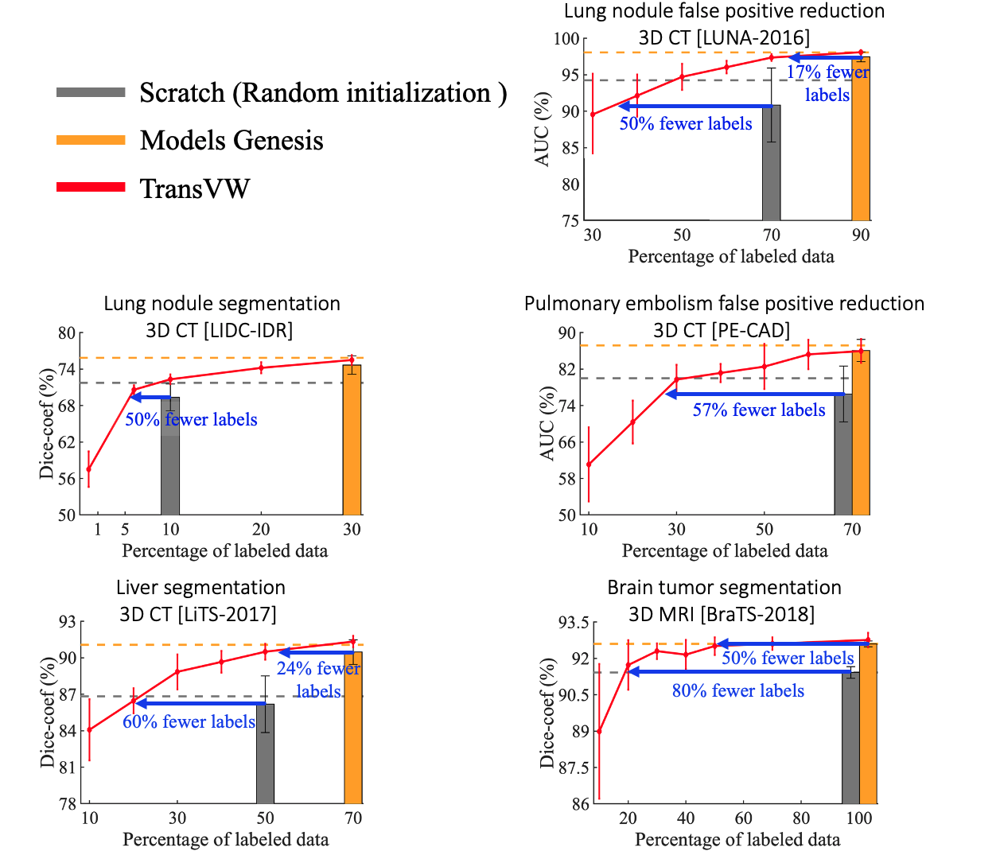

# Transferable Visual Words:  Exploiting the Semantics of Anatomical Patterns for Self-supervised Learning 

We have introduced a new concept called _<b>transferable visual words (TransVW)</b>_, where the sophisticated, consistent, and recurring anatomical patterns across medical images are natural *visual words*. These visual words, associated with rich *semantics* about the human anatomy, can be automatically extracted from unlabeled medical images and serve as strong yet free supervision signals for CNNs to learn generic semantics-enriched representation via self-supervision. TransVW is a fully autodidactic scheme (requiring no manual labeling), serves as an add-on strategy (boosting existing self-supervised methods), and yields semantics-enriched pre-trained models (saving annotation efforts for a variety of 3D medical applications through transfer learning).




## Paper
<b>Transferable Visual Words: Exploiting the Semantics of Anatomical Patterns for Self-supervised Learning </b> <br/>

[Fatemeh Haghighi](https://github.com/fhaghighi)<sup>1</sup>, [Mohammad Reza Hosseinzadeh Taher](https://github.com/MR-HosseinzadehTaher)<sup>1</sup>,[Zongwei Zhou](https://github.com/MrGiovanni)<sup>1</sup>,[Michael B. Gotway](https://www.mayoclinic.org/biographies/gotway-michael-b-m-d/bio-20055566)<sup>2</sup>, [Jianming Liang](https://chs.asu.edu/jianming-liang)<sup>1</sup><br/>
<sup>1</sup> Arizona State University, <sup>2</sup> Mayo Clinic<br/>
IEEE Transactions on Medical Imaging (TMI) <br/>
[paper](https://arxiv.org/pdf/2102.10680.pdf) | [code](https://github.com/fhaghighi/TransVW)


## Available implementation
[](keras/)
&nbsp;&nbsp;&nbsp;&nbsp;&nbsp;
[](pytorch/)
&nbsp;&nbsp;&nbsp;&nbsp;&nbsp;&nbsp;&nbsp;&nbsp;&nbsp;&nbsp;&nbsp;&nbsp;&nbsp;&nbsp;&nbsp;&nbsp;&nbsp;&nbsp;&nbsp;&nbsp;&nbsp;&nbsp;&nbsp;


---------------------

## Visual word learning is an add-on strategy, which boost existing self-supervised methods. 

<p align="center"></p>

## TransVW offers superior transfer learning performance

  
<p align="center"></p>
    
## TransVW accelerates the training process
     
<p align="center"></p>
     
     
 ## TransVW reduces the annotation cost 
     
 <p align="center"></p>
    
Credit to [superbar](https://github.com/scottclowe/superbar) by Scott Lowe for Matlab code of superbar.

## Citation
If you use our source code and/or refer to the baseline results published in the paper, please cite our [paper](https://arxiv.org/abs/2102.10680) by using the following BibTex entry:
```
@ARTICLE{haghighi2021transferable,
  author={Haghighi, Fatemeh and Taher, Mohammad Reza Hosseinzadeh and Zhou, Zongwei and Gotway, Michael B. and Liang, Jianming},
  journal={IEEE Transactions on Medical Imaging}, 
  title={Transferable Visual Words: Exploiting the Semantics of Anatomical Patterns for Self-Supervised Learning}, 
  year={2021},
  volume={40},
  number={10},
  pages={2857-2868},
  doi={10.1109/TMI.2021.3060634}}
```


## Acknowledgement
This research has been supported partially by ASU and Mayo Clinic through a Seed Grant and an Innovation Grant, and partially by the NIH under Award Number R01HL128785. The content is solely the responsibility of the authors and does not necessarily represent the official views of the NIH. This work has utilized the GPUs provided partially by the ASU Research Computing and partially by the Extreme Science and Engineering Discovery Environment (XSEDE) funded by the National Science Foundation (NSF) under grant number ACI-1548562. We thank [Zuwei Guo](https://www.linkedin.com/in/zuwei/) for implementing Rubik's cube, [M. M. Rahman Siddiquee](https://github.com/mahfuzmohammad) for examining NiftyNet, and [Jiaxuan Pang](https://www.linkedin.com/in/jiaxuan-pang-b014ab127/) for evaluating I3D, [Shivam Bajpai](https://github.com/sbajpai2) for helping in adopting TransVW to nnU-Net, and
Shrikar Tatapudi for helping improve the writing of this paper. The content of this paper is covered by patents pending.

## License

Released under the [ASU GitHub Project License](https://github.com/fhaghighi/TransVW/blob/master/LICENSE).
