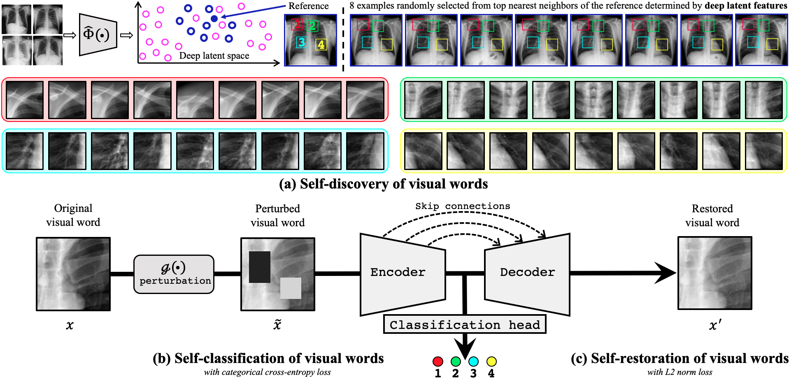

# Transferable Visual Words:  Exploiting the Semantics of Anatomical Patterns for Self-supervised Learning 

This paper introduces a new concept called _<b>transferable visual words (TransVW)</b>_, aiming to achieve annotation efficiency for deep learning in medical image analysis. Medical imaging&mdash;focusing on particular parts of the body for defined clinical purposes&mdash;generates images of great similarity in anatomy across patients and yields sophisticated anatomical patterns across images, which are associated with rich *semantics* about human anatomy and which are natural  *visual words*. We show that these visual words can be automatically harvested according to anatomical consistency via self-discovery, and that the self-discovered visual words can serve as strong yet free supervision signals for deep models to learn semantics-enriched generic image representation via self-supervision (self-classification and self-restoration). 
Our extensive experiments demonstrate the annotation efficiency of TransVW by offering higher performance and faster convergence with reduced annotation cost in several applications. 
Our TransVW has several important advantages, including (1) TransVW is a fully autodidactic scheme, which exploits the semantics of visual words for self-supervised learning, requiring no expert annotation; (2) visual word learning is an add-on strategy, which complements existing self-supervised methods, boosting their performance; and (3) the learned image representation is semantics-enriched models, which have proven to be more robust and generalizable, saving annotation efforts for a variety of applications through transfer learning.




## Paper
<b>Transferable Visual Words: Exploiting the Semantics of Anatomical Patterns for Self-supervised Learning </b> <br/>

[Fatemeh Haghighi](https://github.com/fhaghighi)<sup>1</sup>, [Mohammad Reza Hosseinzadeh Taher](https://github.com/MR-HosseinzadehTaher)<sup>1</sup>,[Zongwei Zhou](https://github.com/MrGiovanni)<sup>1</sup>,[Michael B. Gotway](https://www.mayoclinic.org/biographies/gotway-michael-b-m-d/bio-20055566)<sup>2</sup>, [Jianming Liang](https://chs.asu.edu/jianming-liang)<sup>1</sup><br/>
Arizona State University<sup>1</sup>, </sup>Mayo Clinic, <sup>2</sup><br/>
IEEE Transactions on Medical Imaging (TMI)

## Available implementation
[](keras/)
&nbsp;&nbsp;&nbsp;&nbsp;&nbsp;
[](pytorch/)
&nbsp;&nbsp;&nbsp;&nbsp;&nbsp;&nbsp;&nbsp;&nbsp;&nbsp;&nbsp;&nbsp;&nbsp;&nbsp;&nbsp;&nbsp;&nbsp;&nbsp;&nbsp;&nbsp;&nbsp;&nbsp;&nbsp;&nbsp;


---------------------

## Visual word learning is an add-on strategy, which boost existing self-supervised methods. 

<p align="center"></p>

## TransVW offers superior transfer learning performance

  
<p align="center"></p>
    
## TransVW accelerates the training process
     
<p align="center"></p>
     
     
 ## TransVW reduces the annotation cost 
     
 <p align="center"></p>
    
Credit to [superbar](https://github.com/scottclowe/superbar) by Scott Lowe for Matlab code of superbar.

## Citation
If you use our source code and/or refer to the baseline results published in the paper, please cite our [paper](https://github.com/fhaghighi/SemanticGenesis) by using the following BibTex entry:
```

```


## Acknowledgement
This research has been supported partially by ASU and Mayo Clinic through a Seed Grant and an Innovation Grant, and partially by the NIH under Award Number R01HL128785. The content is solely the responsibility of the authors and does not necessarily represent the official views of the NIH. This work has utilized the GPUs provided partially by the ASU Research Computing and partially by the Extreme Science and Engineering Discovery Environment (XSEDE) funded by the National Science Foundation (NSF) under grant number ACI-1548562. We thank [Zuwei Guo](https://www.linkedin.com/in/zuwei/) for implementing Rubik's cube, [M. M. Rahman Siddiquee](https://github.com/mahfuzmohammad) for examining NiftyNet, and [Jiaxuan Pang](https://www.linkedin.com/in/jiaxuan-pang-b014ab127/) for evaluating I3D, [Shivam Bajpai](https://github.com/sbajpai2) for helping in adopting TransVW to nnU-Net, and
Shrikar Tatapudi for helping improve the writing of this paper. The content of this paper is covered by patents pending.

## License

Released under the [ASU GitHub Project License](https://github.com/fhaghighi/TransVW/blob/master/LICENSE).
